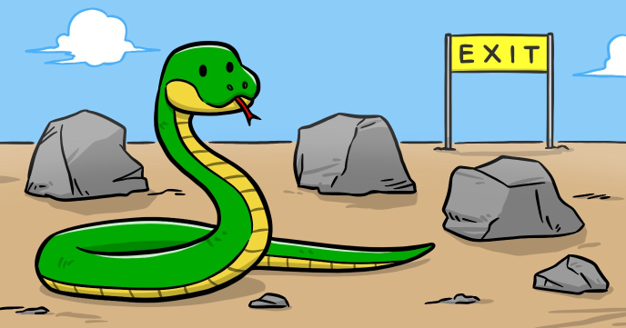

Snake is a game of skills. You need to guide a snake around the obstacles to find the exit door. Once you complete the level, the game advances to a new level where obstacles are not stationary anymore.

While implementing this game you’ll learn game design concepts such as:

-	How to implement a game loop
-	How to read the keyboard during the game loop
-	How to check for collisions
 
## Source code 
The JavaScript source code of this program can be found [here](sketches/program.js). To run it, you need to import it in the [codeguppy.com](https://codeguppy.com) online editor. Alternatively, you can use the source code in your p5.js sketches (advanced use). 
## Online version 
To see the code running, check the online playground at [https://codeguppy.com/code.html?t=snake](https://codeguppy.com/code.html?t=snake) 
## Next steps 
Please check [codeguppy.com](https://codeguppy.com) for many other fun JavaScript programs and games for beginners. To stay up to date with CodeGuppy development please follow [@codeguppy](https://twitter.com/codeguppy) on Twitter.  
